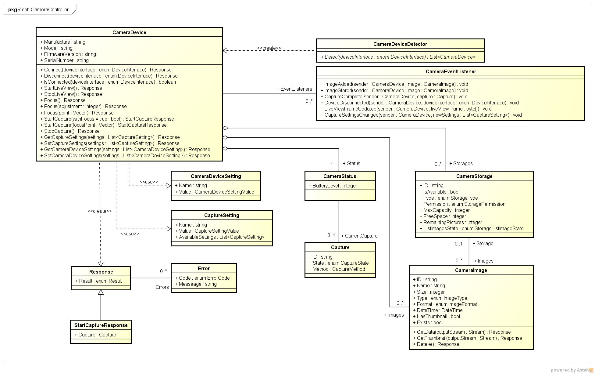

# RICOH Camera USB SDK for Microsoft® .NET Framework

RICOH Camera USB SDK enables your app to operate cameras. This page shows how to use SDK packages and a sample app, which comes with the SDK. Note that code examples in this document is written in C # 5.0.

### Contents

* [Requirements](#requirements)
* [Quick Start](#quick-start)
* [Classes](#classes)
* [Versioning Rules](#versioning-rules)

## Requirements

### Supported Devices

* PENTAX K-1 Mark II
* PENTAX KP
* PENTAX K-1
* PENTAX 645Z

Please set "USB connection" to "PTP" beforehand in camera side setting

### Supported Environments

* Windows
* .NET Framework 4.5 or later

## Quick Start

This section is designed to describe the two approaches to get started with RICOH Camera USB SDK. You can run Sample App to understand what the SDK can do and how it works. Also, you can add the SDK to your existing app to enhance it.

### Run Sample App

Try out Sample App to understand RICOH Camera USB SDK quickly. Sample App has functions such as:

* Connecting to your camera
* Capturing images
* Changing camera settings

There are two options to run Sample App:

* Running the exe file
* Running the app you build from the source code

### Integrate SDK into Your App

Follow the instructions below to integrate RICOH Camera USB SDK with your existing app. You can also refer to Sample App's source code for the basic usage.

1. Add reference of `RicohCameraSDK.dll` to your project.
1. Add the following line to your source code.
```csharp
using Ricoh.CameraController;
```

1. Explore the quick references of each operation and events to enhance your app.
  * [How to connect to cameras](connection.md)
  * [How to get camera information](camera-information.md)
  * [How to capture still images](capture.md)
  * [How to capture movie](movie-capture.md)  
  * [How to handle images](image-handling.md)
  * [How to obtain live view](live-view.md)
  * [How to receive camera events](events.md)
  * [Capture Settings](capture-settings.md)
  * [Camera Settings](camera-settings.md)


## Classes

Ricoh.CameraController framework provides functions for camera operations such as shooting and acquiring images. For detailed class reference, visit [`.NET Framework API Reference`](../../api_reference/index.html).

### Class Diagram

The image below describes the relations of classes in the package.

[](../assets/img/Ricoh.CameraController.png "Ricoh.CameraController.png")

### CameraDevice Class

CameraDevice Class manages camera information and operates cameras. See [`CameraDevice Class in .NET Framework API Reference`](../../api_reference/html/T_Ricoh_CameraController_CameraDevice.htm) for detailed class reference.

### CameraImage Class

CameraImage Class manages image information and image data. See [`CameraImage Class in .NET Framework API Reference`](../../api_reference/html/T_Ricoh_CameraController_CameraImage.htm) for detailed class reference.

## Versioning Rules

RICOH Camera USB SDK conforms to [Semantic Versioning](http://semver.org/spec/v2.0.0.html). See below for versioning rules of the SDK.

### Versioning Syntax

RICOH Camera USB SDK is versioned in accordance with the following syntax:

{MAJOR}.{MINOR}.{PATCH}

Field Name  |Description
------------|---
MAJOR       |Major Version is<br>incremented when some changes that don't have backwards-compatibility with functionality occur.
MINOR       |Minor Version is<br>incremented when some interfaces are changed or added while keep having backwards-compatibility with functionality.<br>In this case, some build errors and other compatible issues may occur in your existing applications.
PATCH       |Patch Version is<br>incremented when some security fixes and bug fixes are made while keep having backwards-compatibility with functionality.<br>In this case, existing application build and compatibility with functionality is guaranteed.
